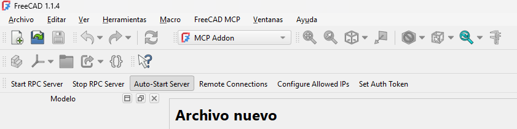
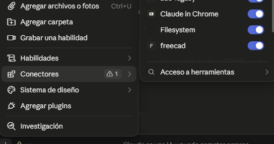

# Claude + CAD

**Install-ClaudeCad.ps1 · v1.4.1 · by [mainmind.com](https://mainmind.com)**

🇪🇸 Español · [🇬🇧 English](README.en.md)

Instalador para Windows que conecta **Claude Desktop** con **FreeCAD** mediante MCP (Model Context Protocol), usando el proyecto de código abierto [neka-nat/freecad-mcp](https://github.com/neka-nat/freecad-mcp). Cuando termina, Claude puede crear y modificar modelos, inspeccionar documentos y ejecutar código Python dentro de FreeCAD.

## Cómo funciona el puente

```
Claude Desktop ──stdio──> servidor MCP (uvx freecad-mcp) ──XML-RPC localhost:9875──> addon FreeCADMCP (dentro de FreeCAD)
```

Son dos piezas: un **addon** que corre dentro de FreeCAD y abre un servidor RPC local, y un **servidor MCP** que lanza Claude Desktop y traduce las peticiones de Claude a llamadas RPC.

## Requisitos

- Windows 10/11 con PowerShell 5.1 o superior
- FreeCAD 1.0 o posterior, **abierto al menos una vez tras instalarlo** (así crea su carpeta de usuario)
- Claude Desktop
- Opcional: git (sin git, el repositorio se descarga en ZIP)

## Descarga

Clona el repositorio o descarga solo esta carpeta, y copia `Install-ClaudeCad.ps1` en tu directorio de trabajo (por defecto `C:\mainmind\ClaudeCad`):

```powershell
New-Item -ItemType Directory -Path C:\mainmind\ClaudeCad -Force | Out-Null
Invoke-WebRequest https://raw.githubusercontent.com/mainmind83/PowerShell/main/ClaudeCad/Install-ClaudeCad.ps1 -OutFile C:\mainmind\ClaudeCad\Install-ClaudeCad.ps1
Unblock-File C:\mainmind\ClaudeCad\Install-ClaudeCad.ps1
```

Antes de ejecutar un script descargado de internet, léelo. Este modifica la configuración de Claude Desktop y de FreeCAD.

## Uso

```powershell
cd C:\mainmind\ClaudeCad
powershell -ExecutionPolicy Bypass -File .\Install-ClaudeCad.ps1
```

| Parámetro | Descripción |
|---|---|
| `-Lang es\|en` | Idioma de los mensajes. Si no se indica, detecta el idioma de Windows y pregunta (Enter acepta el detectado). |
| `-WorkDir <ruta>` | Directorio de trabajo. Por defecto `C:\mainmind\ClaudeCad`. |
| `-FreeCADUserDir <ruta>` | Fuerza la carpeta de usuario de FreeCAD si la detección falla (salida de `FreeCAD.getUserAppDataDir()` en la consola Python de FreeCAD). |
| `-SkipClaudeConfig` | No modifica la configuración de Claude Desktop. |
| `-Feedback text\|image` | Modo de respuesta de FreeCAD hacia Claude. `text` añade `--only-text-feedback` (menos tokens). Si no se indica, se explica y se pregunta en cada ejecución (Enter mantiene el modo actual). |
| `-Force` | Rehace todos los pasos aunque ya estén hechos. |

## Qué hace, paso a paso

1. **Directorio de trabajo.** Crea `C:\mainmind\ClaudeCad` si no existe.
2. **Repositorio.** Clona `neka-nat/freecad-mcp` en `WorkDir\freecad-mcp`. Si ya está clonado, hace `git pull` y avisa si había cambios. Sin git, lo descarga en ZIP.
3. **uv.** Usa `uv`/`uvx` desde `WorkDir\bin`, o lo instala ahí si falta. No modifica el PATH ni el perfil del usuario.
4. **Carpeta de usuario de FreeCAD.** Busca la ruta por defecto `%APPDATA%\FreeCAD\vX-Y` y, si hay varias versiones, elige la más alta. Si no la encuentra, pide abrir FreeCAD una vez y pregunta (S/N) antes de seguir. Crea la carpeta `Mod` si no existe, que es lo normal hasta instalar el primer addon.
5. **Addon.** Copia `addon\FreeCADMCP` a `Mod\FreeCADMCP`. Compara huellas SHA-256 y solo copia si hay diferencias.
6. **Configuración de Claude Desktop.** Añade la entrada `freecad` a `claude_desktop_config.json`, con la ruta absoluta de `uvx.exe`. Respeta las demás entradas, hace una copia de seguridad (`.bak-fecha`) solo cuando va a escribir y guarda en UTF-8 sin BOM. Detecta también la instalación desde Microsoft Store (MSIX).
   - **Modo de respuesta.** En cada ejecución muestra el modo actual y pregunta si usar el modo **solo texto** (`--only-text-feedback`):
     - *Imágenes + texto* (por defecto): cada operación devuelve además una captura del modelo. Claude ve el resultado, pero cada captura consume bastantes más tokens.
     - *Solo texto*: devuelve nombres de objetos, dimensiones y éxito/error. Consume **muchos menos tokens**. Claude puede seguir pidiendo una vista cuando la necesite con `get_view`.
   - Conserva los argumentos y variables de entorno que ya tuviera la entrada (por ejemplo `--host` o `FREECAD_MCP_TOKEN`).

7–9. **Auto-inicio, seguridad y estado del servidor RPC.** Lee los ajustes del addon (`freecad_mcp_settings.json` en la carpeta de usuario de FreeCAD) y:
   - Si el auto-inicio no está activado, pregunta *¿Quieres que el servidor MCP se auto-inicie siempre con FreeCAD?* y, si respondes S, activa `auto_start_rpc`. El cambio se aplica la próxima vez que abras FreeCAD.
   - Revisa la lista de IPs permitidas y **advierte** si contiene algo distinto de localhost (`127.0.0.1`, `::1`, `localhost`). También advierte si las conexiones remotas están activadas, o activadas sin token de autenticación. Solo avisa: no cambia esos valores.
   - Comprueba si FreeCAD está en ejecución y, si no, ofrece abrirlo.
   - Comprueba si el servidor RPC escucha en el puerto 9875 y en qué dirección. Advierte si está expuesto a la red (no loopback).

10. **Claude Desktop.** Comprueba si Claude Desktop está en ejecución. Distingue la app de escritorio de Claude Code, que también se llama `claude.exe`.

Al final muestra un **resumen** y unos **siguientes pasos calculados según el estado real**. Solo pide reiniciar FreeCAD si estaba abierto cuando se instaló o actualizó el addon, o si se activó el auto-inicio con FreeCAD ya abierto y sin RPC. Si FreeCAD estaba cerrado, solo indica que lo abras. Solo pide reiniciar Claude Desktop si cambió `claude_desktop_config.json` y la app está abierta. Si no hace falta nada, dice que todo está listo.

## Idempotencia

Se puede ejecutar tantas veces como se quiera. Cada paso comprueba su estado y, si ya está hecho, lo omite y lo indica con `[SKIP]`. Si no cambia nada, el script lo dice y no toca ningún fichero. Sirve también para actualizar: si el repositorio trae cambios, se actualizan el addon y lo que haga falta.

## Después de instalar

Sigue los *siguientes pasos* que muestra el script al terminar: dependen de si FreeCAD y Claude Desktop estaban abiertos y de qué ha cambiado.

## Capturas

**FreeCAD (1.1.4):** workbench *MCP Addon* con su barra de herramientas. *Auto-Start Server* aparece pulsado cuando el auto-inicio está activado.



**Claude Desktop:** el conector `freecad` aparece en *Conectores* y se puede activar o desactivar por conversación.



## Seguridad

- La herramienta `execute_code` ejecuta **Python arbitrario** dentro de FreeCAD con tus permisos de usuario.
- **No actives las conexiones remotas del addon sin revisar antes la seguridad y el acceso de red.** Por defecto, el servidor RPC debe escuchar solo en `localhost`.
- Evita combinar en la misma conversación este MCP con lectura de contenido externo (webs, correos). Una inyección de prompt podría acabar ejecutando código en tu equipo.

## Limitaciones conocidas

- El addon sale de la rama `main` de GitHub, mientras que `uvx freecad-mcp` usa la última versión publicada en PyPI. Si alguna vez no son compatibles, se puede apuntar Claude al repositorio local con `uvx --from C:\mainmind\ClaudeCad\freecad-mcp freecad-mcp`.
- Las preguntas interactivas (idioma, S/N del paso 4 y las de los pasos 7–9) bloquean si el script se lanza de forma desatendida. Para ese caso, usa `-Lang` y `-FreeCADUserDir`; las preguntas de los pasos 7–9 siguen siendo interactivas.

## Historial de versiones

| Versión | Cambios |
|---|---|
| 1.4.1 | La pregunta del modo de respuesta se hace en cada ejecución, mostrando el modo actual (Enter lo mantiene). |
| 1.4.0 | Opción de modo solo texto (`--only-text-feedback`) en la configuración de Claude, con pregunta y parámetro `-Feedback`. Conserva argumentos y `env` existentes. |
| 1.3.0 | Paso 10: detección de Claude Desktop. Siguientes pasos calculados según el estado real (sin reinicios innecesarios). Nota de seguridad revisada. |
| 1.2.0 | Pasos 7–9: estado de FreeCAD y del servidor RPC, pregunta de auto-inicio, advertencias de seguridad sobre IPs permitidas, conexiones remotas y token. |
| 1.1.0 | Bilingüe (es/en) con detección de idioma y selector; banner; idempotencia completa con resumen final; parámetro `-Force`. |
| 1.0.0 | Versión inicial: uv en `WorkDir\bin`, detección de `%APPDATA%\FreeCAD\vX-Y`, pregunta S/N, creación de `Mod`, configuración de Claude Desktop. |

## Licencia

MIT, como el resto del repositorio. El código de [neka-nat/freecad-mcp](https://github.com/neka-nat/freecad-mcp) (también MIT) no se incluye aquí: el script lo descarga desde su repositorio original.
